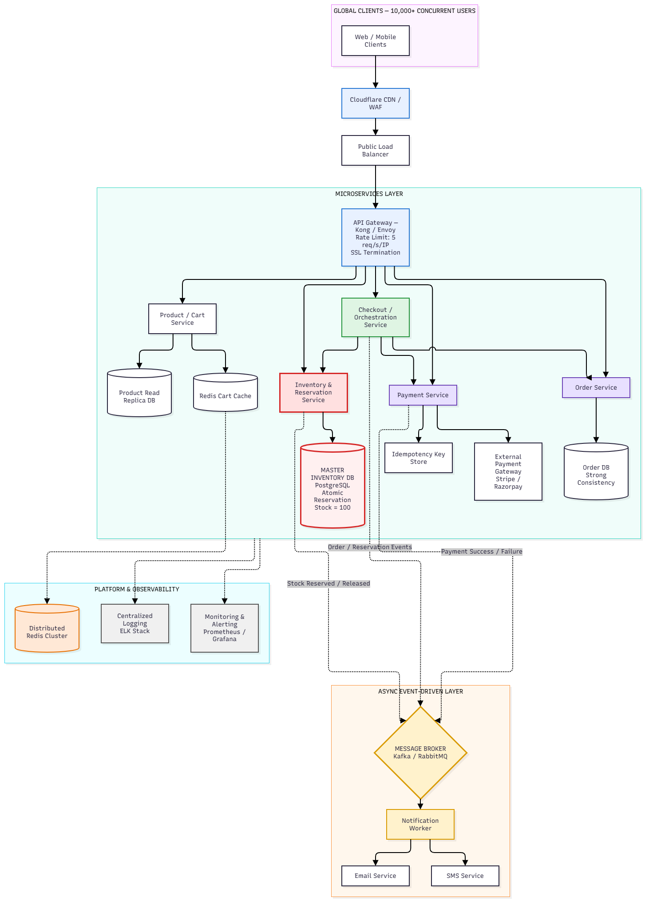

# ⚡ SALESTORM: High-Scale Flash-Sale Architecture & System Design

[](https://www.python.org/)
[](https://fastapi.tiangolo.com/)
[](https://redis.io/)
[](https://www.postgresql.org/)
[](https://opensource.org/licenses/MIT)

**SALESTORM** is a production-grade, highly concurrent e-commerce flash-sale platform designed to handle **10,000 simultaneous purchase requests for exactly 100 limited stock units** without overselling, while ensuring transactional safety and failure recovery.

---

## 🏛️ High-Level Architecture (HLD)



```
10,000 Ingress Callers
          │
          ▼
Cloudflare CDN / WAF (Edge Ingress & Bot Filtering)
          │
          ▼
API Gateway (Strict Rate Limiting: 5 req/s per IP, Token Auth)
          │
          ▼
Inventory Gatekeeper Service (Sub-second SLA)
          │
          ├── [Atomic Check + Decrement] ──► Redis Cluster (Single-Threaded Lua Script)
          │                                      │
          │                                      ├── Stock >= 1: Decrement, issue 300s TTL lease (Status 1)
          │                                      └── Stock == 0: Instant HTTP 409 drop (Status 0, Zero DB load)
          ▼
Checkout / Payment Service
          │
          ├── Idempotency Key Lock (Redis NX EX 30)
          ├── External Payment Gateway (Forwarding Idempotency Token)
          └── Transactional Outbox (Single ACID Boundary in PostgreSQL)
                 ├── INSERT INTO payments (status='SUCCESS')
                 └── INSERT INTO outbox_events (status='PENDING')
          │
          ▼
Asynchronous Reconciliation Worker
          │
          └── Polls outbox_events (SKIP LOCKED) ──► Kafka / RabbitMQ ──► Order Service
```

---

## 📁 Repository Structure

```
System Design/
├── 01_HLD/
│   └── HLD.png                          # High-Level Architecture Diagram
├── 03_LLD/
│   ├── reserve_stock.lua                # Single-threaded atomic Redis stock reservation script
│   ├── inventory_service.py             # FastAPI gatekeeper executing Lua script via SHA1 cache
│   ├── payment_service.py               # Payment service with Idempotency Engine & Outbox Pattern
│   └── outbox_recovery_worker.py        # Outbox polling worker with exponential backoff & DLQ
├── 04_Database/
│   └── schema.sql                       # PostgreSQL DDL with check constraints and partial indexes
├── 05_API/
│   └── openapi.yaml                     # OpenAPI 3.0 (Swagger) specification for flash-sale endpoints
├── 11_AI_Assisted_Validation/
│   ├── stress_test_10k.py               # 10,000 parallel coroutines concurrency stress test
│   └── test_payment_and_outbox.py       # Integration suite verifying idempotency & broker recovery
├── 12_Prototype/
│   └── dashboard.py                     # Streamlit live simulation dashboard prototype
└── README.md
```

---

## 🛡️ Core Architectural Invariants

| Challenge / Invariant | Engineering Guarantee |
| :--- | :--- |
| **Zero Overselling** | $\text{available\_quantity} \ge 0$, and $\sum \text{confirmed\_sales} \le 100$. Evaluated atomically inside single Redis event loop via Lua. |
| **Zero DB Contention** | 9,900 losing requests are rejected in-memory at the Redis gatekeeper. Zero contention on relational connection pools. |
| **Payment Idempotency** | Prevents double billing on network retry by caching completed transactions for 24h and replaying original transaction IDs. |
| **Crash & Outage Resilience** | Transactional Outbox pattern guarantees payment records and outbox events commit inside the exact same SQL transaction. |
| **Lease Expiry / Abandonment** | Reservations hold a 300-second TTL lease. Unclaimed units are returned to the stock pool. |

---

## 📊 Concurrency Stress Test Results

Executed with 10,000 parallel coroutines synchronized across an `asyncio.Event` gate:

```text
================================================================
SALESTORM: 10,000 CONCURRENT REQUESTS STRESS HARNESS
Target Item: flash_deal_macbook_pro
Initial Stock: 100
Concurrent Callers: 10000
================================================================
-> 10000 coroutines ready and waiting on gate...

--- RESULTS & INVARIANT VERIFICATION ---
Total Completed Requests : 10000
Execution Duration       : 19.715 seconds
Throughput               : 507 req/sec
Confirmed Reservations   : 100  (Status = 1)
Rejected (Out of Stock)  : 9900 (Status = 0)
Errors / Collisions      : 0
Final Available Stock    : 0

[PASSED] Invariant held: Zero oversell. Exactly 100 units reserved across 10,000 parallel requests.
```

---

## 🚀 Running the Prototype & Tests Locally

### 1. Install Dependencies
```bash
pip install fastapi uvicorn redis fakeredis lupa sqlalchemy aiosqlite asyncpg httpx streamlit pydantic pyyaml
```

### 2. Run Concurrency Stress Harness
```bash
python "11_AI_Assisted_Validation/stress_test_10k.py"
```

### 3. Run Payment Idempotency & Outbox Recovery Suite
```bash
python "11_AI_Assisted_Validation/test_payment_and_outbox.py"
```

### 4. Launch Live Streamlit Simulation Dashboard
```bash
streamlit run "12_Prototype/dashboard.py"
```

Access the dashboard at `http://localhost:8501`.
